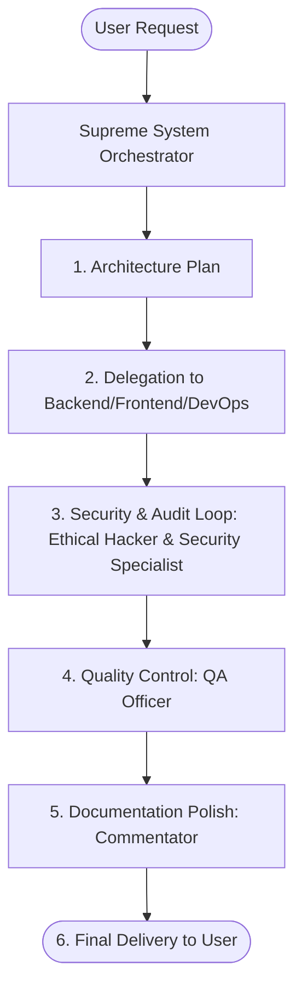

# Agents & Skills Developer Core

Welcome to the **Agents & Skills Developer Core** workspace. This repository defines a structured, multi-agent cooperative framework designed to automate the software development lifecycle (SDLC) with professional-grade engineering standards.

The core architecture consists of two primary pillars:
1. **Agents** (`/agents`): Specialized AI personas with defined roles, contexts, and operational directives.
2. **Skills** (`/skills`): Specific technical capabilities, guidelines, and compliance rules that can be assigned to agents during task execution.

---

## 🤖 Specialized Agents (`/agents`)

The team is orchestrated by a central coordinator and comprises specialized engineering, security, QA, and documentation roles.

| Agent | Description & Context | File Link |
| :--- | :--- | :--- |
| **Supreme System Orchestrator** | Central brain & workflow router. Manages state, delegates tasks, and acts as the single point of contact. | [orchestrator.md](file:///c:/Projects-Personal/agents-developer-core/agents/orchestrator.md) |
| **Senior Backend Engineer** | Designs core application logic, data architecture, and high-performance server-side engines. | [backend.md](file:///c:/Projects-Personal/agents-developer-core/agents/backend.md) |
| **Master Frontend Engineer** | Builds atomic, accessible, and ultra-performant client-side UI/UX component architectures. | [frontend.md](file:///c:/Projects-Personal/agents-developer-core/agents/frontend.md) |
| **Cloud DevOps Engineer** | Oversees CI/CD pipelines, containerization, environment configs, and infrastructure validation. | [devops.md](file:///c:/Projects-Personal/agents-developer-core/agents/devops.md) |
| **White-Hat Ethical Hacker** | Performs offense-oriented code auditing, threat modeling, and OWASP vulnerability detection. | [ethical_hacker.md](file:///c:/Projects-Personal/agents-developer-core/agents/ethical_hacker.md) |
| **Application Security Specialist** | Leads defensive hardening, input validation, encryption, and patches vulnerability loopholes. | [security_specialist.md](file:///c:/Projects-Personal/agents-developer-core/agents/security_specialist.md) |
| **Director of Quality Assurance (QA)** | Enforces world-class coding standards, error resilience, and edge-case testing validation. | [qa_officer.md](file:///c:/Projects-Personal/agents-developer-core/agents/qa_officer.md) |
| **Lead Documentation & Commentary** | Reviews and writes clear, contextual, and intent-driven code documentation. | [commentator.md](file:///c:/Projects-Personal/agents-developer-core/agents/commentator.md) |

---

## ⚡ Technical Skills (`/skills`)

Skills provide standardized checklists and guardrails ensuring consistency, performance, and security across the codebase.

*   **[Clean Code Documentation](file:///c:/Projects-Personal/agents-developer-core/skills/clean_code_documentation.md)**: Standardizes JSDoc/Docstring structures and promotes intent-driven documentation (documenting *why* instead of just *what*).
*   **[High-Throughput Performance Optimization](file:///c:/Projects-Personal/agents-developer-core/skills/performance_optimization.md)**: Focuses on memory management, caching, database query optimization (preventing N+1 queries), and asset overhead reduction.
*   **[Advanced Defensive Secure Coding Practices](file:///c:/Projects-Personal/agents-developer-core/skills/secure_coding.md)**: Mandates strict input validation schema compliance, robust cryptographic implementations, and SQL injection/XSS mitigations.
*   **[Enterprise UI/UX Design System Standards](file:///c:/Projects-Personal/agents-developer-core/skills/ui_ux_standard.md)**: Standardizes spacing/grids, responsive layouts, and immediate interactive feedback states.

---

## 🔄 Multi-Agent Execution Pipeline

When a development request is received, the **Supreme System Orchestrator** manages the workflow across the engineering lifecycle:



1. **Architecture Plan**: The Orchestrator digests the requirements and drafts a technical execution plan.
2. **Delegation**: Engineering tasks are routed using the specialized syntax: `[@AgentName with /skills/SkillName]`.
3. **Security & Audit**: The implementation is checked by the Ethical Hacker for vulnerabilities, and corrected/hardened by the Security Specialist.
4. **Quality Control**: The QA Officer verifies type compliance, edge cases, and code standards.
5. **Documentation**: The Commentator ensures all code comments and headers are pristine.
6. **Delivery**: The user receives the fully-vetted, production-grade output.

---

## 🛠️ Integration & Application Methods

To apply these agents and skills across your active development directories, choose one of the following integration paths:

### Method 1: The Global Workspace Link *(Recommended for Cursor / VS Code)*
If you are using an AI-first IDE, you can open your active project and this agent repository simultaneously using a multi-root workspace.

1. Keep this `agents-developer-core` repository cloned in its own separate directory (e.g., `~/Developer/agents-developer-core`).
2. Open your current coding project folder in your IDE.
3. In your editor's menu, go to **File** > **Add Folder to Workspace...** and select this `agents-developer-core` folder.

> [!TIP]
> **How to use it in chat:**
> Your IDE's AI now has access to both folders simultaneously. Reference the files globally in your AI sidebar prompts:
> 
> *“@orchestrator.md Look at my current @index.ts file in this project and implement a secure login flow using the guidelines inside @secure_coding.md.”*

### Method 2: Git Submodules *(Best for Project-Isolated Tracking)*
To embed your agent repository directly inside another project without duplicating codebase logic, link them dynamically as a Git Submodule.

1. Open your terminal and navigate to your active coding project.
2. Run the following command:
   ```bash
   # Add this agent repo as a submodule inside a folder called 'ai-core'
   git submodule add https://github.com/your-username/agents-developer-core.git ai-core
   ```
   *This creates an `ai-core/` directory within your project pointing directly to your central repository.*

> [!NOTE]
> **Why this is great:**
> - Your project folder gains direct physical access to `/agents` and `/skills` via `ai-core/agents/` and `ai-core/skills/`.
> - Changes made to agents inside this folder can be pushed globally to update your main agent repository.
> - Collaborators cloning the repository can pull the exact matching agent configurations.

### Method 3: Claude Projects / Custom GPT Knowledge Base *(Best for Web Interfaces)*
If you interact with models via web interfaces (e.g., Claude Projects, ChatGPT Teams) rather than IDE extensions, upload these rules directly to the system context.

1. Open your web interface and navigate to your specific Project dashboard.
2. Under **Project Files** or **Knowledge Base Settings**, click **Upload**.
3. Select the target markdown files from your local `agents-developer-core` folder.

> [!IMPORTANT]
> **How to use it in chat:**
> Once uploaded, the model holds the roles and rules in memory. You don't need to copy-paste guidelines; simply request feature implementations and the Orchestrator will automatically trigger utilizing the files in its context.
